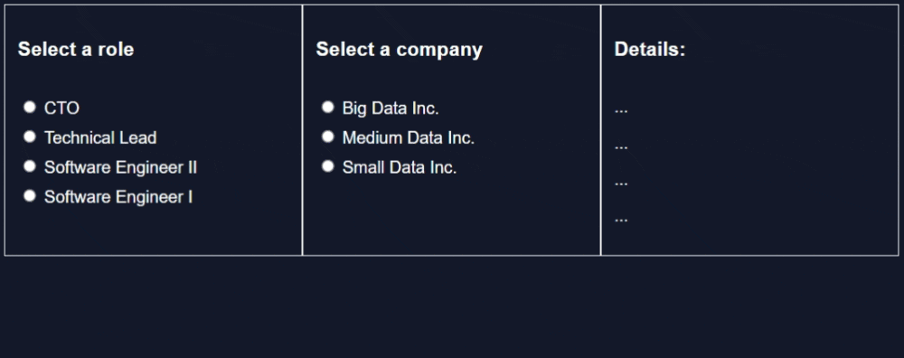

# Dynamic Salary Data with JS

 

  

  <h3 align="center">Foreword</h3>

  

    Demonstrating design best practices with 'seperation-of-concern' (SoC) techniques to dynamically render salary data via user input.
     
    <a href="https://github.com/jgome284/salary-js/issues">Report Bug</a>
    ·
    <a href="https://github.com/jgome284/salary-js/issues">Request Feature</a>
  

## Table of Contents

- [Dynamic Salary Data with JS](#dynamic-salary-data-with-js)
  - [Table of Contents](#table-of-contents)
  - [About](#about)
  - [Prerequisites](#prerequisites)
  - [Getting started](#getting-started)
  - [License](#license)

<!-- ABOUT -->
## About

This repository features a simple web application that dynamically redors salary data from a small dataset. It demonstrates Seperation of Concerns (SoC) via distict features in the [modules](./modules/) folder. SoC is a design principle that manages complexity by partitioning a computer program into distinct features that overlap in functionality as little as possible.

<!--PREREQUISITES-->
## Prerequisites

To start, you need to have Visual Studio Code downloaded on your machine. You should have it installed along with the [live server](https://marketplace.visualstudio.com/items?itemName=ritwickdey.LiveServer&ssr=false#review-details) extension to enable a local development server with live reload features for static & dynamic pages. Without it you will run into [CORS](https://developer.mozilla.org/en-US/docs/Web/HTTP/CORS) issues. Modules only work via HTTP(S) protocols imports. For more information reference this post on [Stack Overflow](https://stackoverflow.com/questions/52919331/access-to-script-at-from-origin-null-has-been-blocked-by-cors-policy).

<!--GETTING STARTED -->
## Getting started

Git clone this repository to your local machine. This will give you access to all the files. Open the project folder on VS Code. With the [live server](https://marketplace.visualstudio.com/items?itemName=ritwickdey.LiveServer&ssr=false#review-details) extension installed, start your local development server. This can be done by launching the command palette `ctrl + shift + p` and executing the `Live Server: Open with Live Server` command. The webpage will render via `index.html` and display data for salary based on role and company inputs as shown below.

## License

Distributed under the MIT License. See `LICENSE` for more information.
